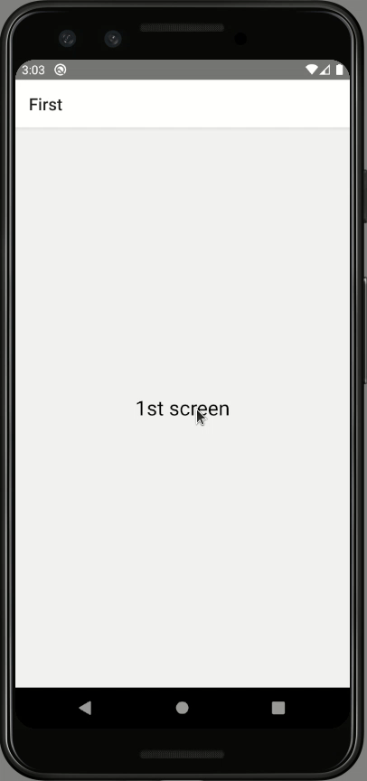

# POC: React Navigation Stack

It demonstrate how to implement a type-safe parameter-based Stack Navigation UI.

## How to run

| Description | Command |
| :--- | :--- |
| Install dependencies | `npm install` |
| Run tests | `npm test` |
| Start Metro | `npm start` |
| Run app | `npm run android` |

## Preview

